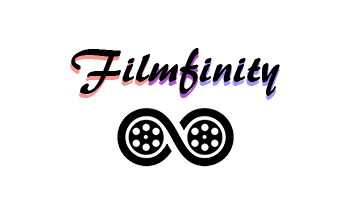

  

# Filmfinity - Infinite movies in zero time

Το παρόν αποτελεί μέρος της εργασίας που είχαμε να εκτελέσουμε στο πλαίσιο του μαθήματος Τεχνολογίας Λογισμικού στο τμήμα Μηχανικών Η/Υ και Πληροφορικής του Πανεπιστημίου Πατρών. Αποφασίσαμε να φτιάξουμε ένα σύστημα το οποίο μπορούν να χρησιμοποιούν οι χρήστες για να απολαμβάνουν ταινίες των δικών τους προτιμήσεων. Επιτρέπει την συμμετοχή Απλών Χρηστών, Χρηστών επι πληρωμή και Διαχειριστών της Βάσης Δεδομένων. Ο κάθε χρήστης μπορεί να εκτελέσει συγκεκριμένες ενέργειες, τις οποίες αναλύουμε στο Documentation. 

# Μέλη Ομάδας (Ονοματεπώνυμο - Αριθμός Μητρώου)
<ul>
  <li><a href="https://github.com/helentogia">Ελένη Τόγια - Α.Μ.: 1054395</a></li>
  <li><a href="https://github.com/Chrishadj17">Χρήστος Χατζησοφοκλέους - Α.Μ.: 1056863</a></li>
  <li><a href="https://github.com/AggelosZacharia">Άγγελος Ζαχαρία - Α.Μ.: 1056906</a></li>
  <li><a href="https://github.com/Mitsios325">Δημήτρης Τρύφωνος - Α.Μ.: 1056651</a></li>
</ul>
